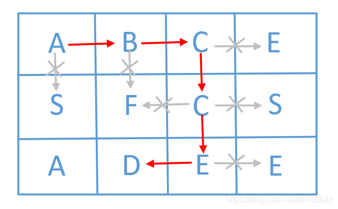

$$
\begin{matrix}
   a & b & c & e  \\
   a & f & c & s \\
   a & d & e & e
  \end{matrix} 
$$

请设计一个函数，用来判断在一个[矩阵](https://so.csdn.net/so/search?q=%E7%9F%A9%E9%98%B5&spm=1001.2101.3001.7020)中是否存在一条包含某字符串所有字符的路径。路径可以从矩阵中的任意一个格子开始，每一步可以在矩阵中向左，向右，向上，向下移动一个格子。如果一条路径经过了矩阵中的某一个格子，则该路径不能再进入该格子。 例如

矩阵中包含一条字符串"bcced"的路径，但是矩阵中不包含"abcb"路径，因为字符串的第一个字符b占据了矩阵中的第一行第二个格子之后，路径不能再次进入该格子。

## 解题思路

题目中说到移动路径可以是上下左右不限方向，只是不能回走到已经走过的路径，那么我们会联想到利用回溯法来解决这道题。回溯法非常适合解决由多个步骤组成的问题，而且每个步骤都有多个选项。回溯法一般用递归来实现。
回溯算法实际上一个类似枚举的搜索尝试过程，主要是在搜索尝试过程中寻找问题的解，当发现已不满足求解条件时，就“回溯”返回，尝试别的路径。回溯法是一种选优搜索法，按选优条件向前搜索，以达到目标。但当探索到某一步时，发现原先选择并不优或达不到目标，就退回一步重新选择，这种走不通就退回再走的技术为回溯法，而满足回溯条件的某个状态的点称为“回溯点”。许多复杂的，规模较大的问题都可以使用回溯法，有“通用解题方法”的美称。

回溯算法实际上一个类似枚举的搜索尝试过程，也就是一个个去试，我们解这道题也是通过一个个去试，遍历过程如下图所示：

**这题我们只需将遍历走过的元素替换成‘\0’(字符串中不存在的值)，这样就能很好的结合回溯法来满足题目要求了。**

代码执行大致过程如下：
首先在board数组中找到一个位置，使得board[i][j] == word[0]，可以作为搜索的入口。由于题目说明遍历过的元素不能重复访问，因此我们只需将遍历走过的元素替换成‘\0’(字符串中不存在的值)。然后通过上下左右搜索直到找到一个可行解即返回true，再继续进行下一元素的匹配搜索。若上下左右都没有元素与字符串字符匹配，那么就返回false，代表搜索失败。如果匹配到字符串末尾全部匹配上，则返回true，代表路径搜索成功。

